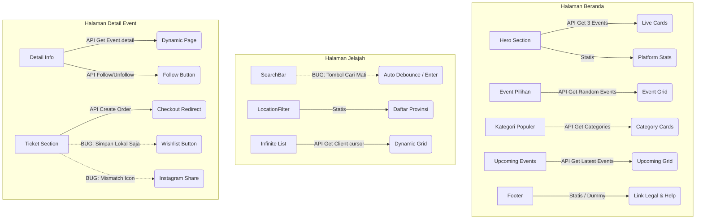

# Audit Integrasi API & Fungsionalitas Halaman Publik (Beranda, Jelajah, Detail Event)

Dokumen ini berisi hasil analisis mendalam terhadap kesiapan integrasi API dan fungsi elemen interaktif pada tiga halaman publik utama aplikasi **Kumpulin**:
1. **Halaman Beranda (Home Page)**
2. **Halaman Jelajah (Explore Page)**
3. **Halaman Detail Event (Event Detail Page)**

---

## 📊 Ringkasan Status Integrasi Halaman

Secara umum, arsitektur aplikasi sudah sangat baik. Mayoritas data utama (seperti daftar event, kategori dinamis, profil organizer, check-out tiket, dan follow organizer) sudah **terintegrasi 100% dengan API Backend**. Namun, terdapat beberapa komponen visual pendukung, tautan navigasi sekunder, serta fitur tertentu yang masih menggunakan data statis/mockup atau memiliki bug interaksi tombol.



---

## 1. Halaman Beranda (Home Page)
*File Utama:* [page.tsx](file:///home/rhein/RHEIN/Programming/Capstone%20TA/CAPSTONE_EMS/Kumpulin_EMS/app/page.tsx)  
*Status Umum:* **90% Terintegrasi API**

### Detail Analisis Komponen:
| Nama Komponen | Lokasi File | Status API | Status Tombol / Fungsionalitas | Keterangan / Temuan |
| :--- | :--- | :---: | :---: | :--- |
| **LandingNavbar** | [LandingNavbar.tsx](file:///home/rhein/RHEIN/Programming/Capstone%20TA/CAPSTONE_EMS/Kumpulin_EMS/components/landingpage/LandingNavbar.tsx) | **Dinamis** | **Berfungsi** | Membaca status auth via `useAuthStore` (Zustand). Tombol Masuk, Daftar, Profil User, Menu berdasarkan Role, dan Tombol Keluar (Logout) terintegrasi API dan berfungsi 100%. |
| **Hero (Banner & Search)** | [Hero.tsx](file:///home/rhein/RHEIN/Programming/Capstone%20TA/CAPSTONE_EMS/Kumpulin_EMS/components/landingpage/Hero.tsx) | **Dinamis** | **Berfungsi** | - Mengambil 3 event terpopuler untuk tumpukan kartu via endpoint `${NEXT_PUBLIC_API_URL}/events?limit=3`.  <br>- Input Cari & Quick Tags berfungsi mengalihkan ke halaman Jelajah dengan query parameters. <br>- **Dummy:** Indikator statistik platform (STATS: `1.200+ Event`, `50K+ Peserta`, `34 Kota`) masih statis (hardcoded). |
| **EventsSuggestion** | [EventsSuggestion.tsx](file:///home/rhein/RHEIN/Programming/Capstone%20TA/CAPSTONE_EMS/Kumpulin_EMS/components/landingpage/EventsSuggestion.tsx) | **Dinamis** | **Berfungsi** | Mengambil 4 event pilihan secara acak via `EventService.getRandomEvents()`. Tombol "Lihat Semua" berfungsi mengarahkan ke `/events?sort=Populer`. |
| **PopularCategory** | [PopularCategory.tsx](file:///home/rhein/RHEIN/Programming/Capstone%20TA/CAPSTONE_EMS/Kumpulin_EMS/components/landingpage/PopularCategory.tsx) | **Dinamis** | **Berfungsi** | Kategori diambil dinamis via `EventService.getEventCategories()`. Klik pada kartu kategori mengarahkan ke halaman Jelajah dengan filter kategori yang tepat. |
| **UpcomingEvents** | [UpcomingEvents.tsx](file:///home/rhein/RHEIN/Programming/Capstone%20TA/CAPSTONE_EMS/Kumpulin_EMS/components/landingpage/UpcomingEvents.tsx) | **Dinamis** | **Berfungsi** | Mengambil 8 event terbaru via `EventService.getEvents({ limit: 8 })`. Renders dynamic `<EventCard>`s. |
| **CallToAction** | [CallToAction.tsx](file:///home/rhein/RHEIN/Programming/Capstone%20TA/CAPSTONE_EMS/Kumpulin_EMS/components/landingpage/CallToAction.tsx) | **Dinamis** | **Berfungsi** | Tombol bertindak dinamis sesuai auth & role user (Daftar Sekarang untuk Guest, Buat Event untuk Organizer, Jelajah Event untuk User). |
| **LandingFooter** | [LandingFooter.tsx](file:///home/rhein/RHEIN/Programming/Capstone%20TA/CAPSTONE_EMS/Kumpulin_EMS/components/landingpage/LandingFooter.tsx) | Statis | **DUMMY** | Tautan sosial media berfungsi. Namun, seluruh tautan internal (Tentang Kami, Syarat & Ketentuan, WhatsApp, Email, dll) **menggunakan `href="/"` (dummy)** yang hanya mereload halaman beranda. |

---

## 2. Halaman Jelajah (Explore Page)
*File Utama:* [page.tsx](file:///home/rhein/RHEIN/Programming/Capstone%20TA/CAPSTONE_EMS/Kumpulin_EMS/app/%28guest%29/events/%28list%29/page.tsx)  
*Status Umum:* **95% Terintegrasi API (1 Bug Kritis)**

### Detail Analisis Komponen:
| Nama Komponen | Lokasi File | Status API | Status Tombol / Fungsionalitas | Keterangan / Temuan |
| :--- | :--- | :---: | :---: | :--- |
| **SearchBar** | [SearchBar.tsx](file:///home/rhein/RHEIN/Programming/Capstone%20TA/CAPSTONE_EMS/Kumpulin_EMS/components/explore/SearchBar.tsx) | **Dinamis** | **ADA BUG** | Input pencarian melakukan auto-pencarian (debounce 500ms) dan mendukung tombol `Enter`. <br>⚠️ **Bug Kritis:** Tombol **"Cari"** versi desktop (pada baris 82-88) **sama sekali tidak berfungsi saat diklik** karena tidak didefinisikan event `onClick` maupun pembungkus `form`. |
| **FilterBar** | [FilterBar.tsx](file:///home/rhein/RHEIN/Programming/Capstone%20TA/CAPSTONE_EMS/Kumpulin_EMS/components/explore/FilterBar.tsx) | **Dinamis** | **Berfungsi** | Tombol **Reset** berfungsi menghapus seluruh query parameter filter secara instant dan memuat ulang data. |
| **CategoryFilter** | [CategoryFilter.tsx](file:///home/rhein/RHEIN/Programming/Capstone%20TA/CAPSTONE_EMS/Kumpulin_EMS/components/explore/CategoryFilter.tsx) | **Dinamis** | **Berfungsi** | Memanggil API dinamis `EventService.getEventCategories()`. Berfungsi menyaring data. |
| **LocationFilter** | [LocationFilter.tsx](file:///home/rhein/RHEIN/Programming/Capstone%20TA/CAPSTONE_EMS/Kumpulin_EMS/components/explore/LocationFilter.tsx) | Statis | **Berfungsi** | Daftar provinsi diambil dari konstanta lokal client-side `INDONESIA_REGIONS` (bukan dari API lokasi khusus). Namun, integrasi pengiriman query param `?province=` ke API `getEvents` tetap berjalan lancar. |
| **PriceFilter** | [PriceFilter.tsx](file:///home/rhein/RHEIN/Programming/Capstone%20TA/CAPSTONE_EMS/Kumpulin_EMS/components/explore/PriceFilter.tsx) | Statis | **Berfungsi** | Opsi filter statis (Semua Harga, Gratis, Berbayar) yang normal untuk kebutuhan UI. Query param `?price=` terintegrasi penuh. |
| **SortByFilter** | [SortByFilter.tsx](file:///home/rhein/RHEIN/Programming/Capstone%20TA/CAPSTONE_EMS/Kumpulin_EMS/components/explore/SortByFilter.tsx) | Statis | **Berfungsi** | Opsi pengurutan statis (Terbaru, Terdekat, Harga Terendah/Tinggi). Query param `?sort=` terintegrasi penuh. |
| **InfiniteEventList** | [InfiniteEventList.tsx](file:///home/rhein/RHEIN/Programming/Capstone%20TA/CAPSTONE_EMS/Kumpulin_EMS/components/explore/InfiniteEventList.tsx) | **Dinamis** | **Berfungsi** | Menggunakan client-side paginasi berbasis `IntersectionObserver`. Memanggil API `EventService.getEventsClient` untuk memuat halaman berikutnya secara lazy-load. Berfungsi dengan sangat mulus. |

---

## 3. Halaman Detail Event (Event Detail Page)
*File Utama:* [page.tsx](file:///home/rhein/RHEIN/Programming/Capstone%20TA/CAPSTONE_EMS/Kumpulin_EMS/app/%28guest%29/events/%5Bslug%5D/page.tsx)  
*Status Umum:* **90% Terintegrasi API (2 Bug Kritis)**

### Detail Analisis Komponen:
| Nama Komponen | Lokasi File | Status API | Status Tombol / Fungsionalitas | Keterangan / Temuan |
| :--- | :--- | :---: | :---: | :--- |
| **EventDetailHeader**| [EventDetailHeader.tsx](file:///home/rhein/RHEIN/Programming/Capstone%20TA/CAPSTONE_EMS/Kumpulin_EMS/components/eventdetail/EventDetailHeader.tsx) | **Dinamis** | **Berfungsi** | Sama dengan LandingNavbar, membaca status auth & profile user secara live. |
| **ImageSection** | [ImageSection.tsx](file:///home/rhein/RHEIN/Programming/Capstone%20TA/CAPSTONE_EMS/Kumpulin_EMS/components/eventdetail/ImageSection.tsx) | **Dinamis** | **Berfungsi** | Banner utama & galeri gambar diambil secara dinamis dari database event (`event.images`). |
| **DetailSection** | [DetailSection.tsx](file:///home/rhein/RHEIN/Programming/Capstone%20TA/CAPSTONE_EMS/Kumpulin_EMS/components/eventdetail/DetailSection.tsx) | **Dinamis** | **Berfungsi** | - Seluruh detail acara (deskripsi TipTap, kota, rundown, koordinat peta) dinamis. <br>- Tombol **Follow/Unfollow Organizer** **berfungsi penuh** dan langsung memotong ke database melalui `UserService.followOrganizer` dan `UserService.unfollowOrganizer`. |
| **TicketSection** | [TicketSection.tsx](file:///home/rhein/RHEIN/Programming/Capstone%20TA/CAPSTONE_EMS/Kumpulin_EMS/components/eventdetail/TicketSection.tsx) | **Dinamis** | **DUMMY & BUG** | - **Kalkulasi & countdown:** Berfungsi dan dinamis sesuai kategori tiket, kapasitas terisi, dan durasi registrasi. <br>- **Tombol "Beli Tiket" / "Daftar Sekarang":** **Berfungsi penuh** terintegrasi dengan API `OrderService.createOrder` yang langsung menghasilkan data transaksi dan meredirect user ke halaman `/checkout/[order_id]`. <br>- ⚠️ **Temuan Bug 1 (Tombol Wishlist Dummy):** Tombol hati (wishlist) **hanya mengubah state React lokal** (`isWishlisted`). Tidak ada backend controller maupun frontend service untuk fitur ini, sehingga data wishlist langsung hilang saat page refresh. <br>- ⚠️ **Temuan Bug 2 (Instagram & Ikon Telepon):** Tombol share Instagram malah menggunakan **ikon `<Phone />`** (baris 777) daripada ikon Instagram. Selain itu, tautannya menggunakan URL sharing dummy yang secara teknis tidak didukung oleh Instagram. |

---

## 🛠️ Rekomendasi Solusi Perbaikan

Berikut adalah potongan kode solusi konkret yang dapat digunakan untuk melengkapi halaman-halaman tersebut agar fungsionalitasnya menjadi **100% sempurna**:

### 1. Memperbaiki Tombol "Cari" di Halaman Jelajah (`SearchBar.tsx`)
Tambahkan handler `onClick` pada tombol "Cari" desktop agar memicu pencarian ketika diklik secara langsung, alih-alih hanya mengandalkan tombol Enter atau auto-debounce.

> [!TIP]
> **Solusi:** Tambahkan state penampung nilai input atau ambil nilai input langsung melalui referensi (`useRef` atau event target), lalu kaitkan ke fungsi `updateQuery`.
>
> *Modifikasi baris 72-88 di `SearchBar.tsx`:*
> ```tsx
> // Definisikan ref untuk input
> const inputRef = React.useRef<HTMLInputElement>(null);
> 
> // Pada input element, pasang ref
> <Input ref={inputRef} ... />
> 
> // Pada tombol Cari, berikan event handler onClick:
> <button
>   type="button"
>   onClick={() => {
>     debouncedSearch.cancel();
>     updateQuery(inputRef.current?.value || "");
>   }}
>   className="..."
> >
>   Cari
> </button>
> ```

---

### 2. Memperbaiki Bug Ikon & URL Share Instagram (`TicketSection.tsx`)
Ganti ikon `<Phone />` dengan ikon media sosial yang sesuai, dan arahkan link share Instagram ke halaman profil/tata cara share yang valid jika tidak bisa membagikan link secara langsung.

> [!WARNING]
> Instagram tidak memiliki URL sharing link publik (seperti Twitter/Facebook). Cara terbaik di web adalah menyalin tautan (Copy Link) atau mengarahkan ke panduan. Namun, jika ingin tetap menyediakan tombol share visual, pastikan setidaknya menggunakan ikon yang representatif (seperti ikon `Instagram` dari `lucide-react`).
> 
> *Modifikasi baris 773-780 di `TicketSection.tsx`:*
> ```diff
> - import { Minus, Plus, Facebook, Link as LinkIcon, Loader2, X, Phone, Heart, Clock, Flame } from "lucide-react";
> + import { Minus, Plus, Facebook, Link as LinkIcon, Loader2, X, Instagram, Heart, Clock, Flame } from "lucide-react";
> ```
> Serta ganti pemanggilan komponen ikonnya:
> ```diff
> - <Phone size={16} />
> + <Instagram size={16} />
> ```

---

### 3. Arsitektur untuk Mengaktifkan Tombol Wishlist (Opsional Masa Depan)
Jika Anda ingin menyempurnakan fitur wishlist agar tidak lagi dummy, berikut adalah langkah-langkah yang diperlukan di backend dan frontend:

#### A. Backend (Go - `capstone-backend`):
1. Buat tabel database `wishlists` (penghubung `user_id` dan `event_id`).
2. Implementasikan API endpoints:
   - `POST /api/v1/events/:id/wishlist` (Menambahkan / menghapus wishlist - toggle).
   - `GET /api/v1/events/:id/wishlist-status` (Mendapatkan status wishlist user saat ini).

#### B. Frontend (Next.js - `Kumpulin_EMS`):
1. Daftarkan fungsi pemanggilan API baru di `user-service.ts`:
   ```typescript
   async toggleWishlist(eventId: string) {
       const response = await axiosClient.post(`/events/${eventId}/wishlist`);
       return response.data;
   },
   async getWishlistStatus(eventId: string) {
       const response = await axiosClient.get(`/events/${eventId}/wishlist-status`);
       return response.data;
   }
   ```
2. Hubungkan state `isWishlisted` di `TicketSection.tsx` menggunakan `useEffect` untuk mengambil status awal, dan panggil `toggleWishlist` di dalam `onClick` tombol hati.
